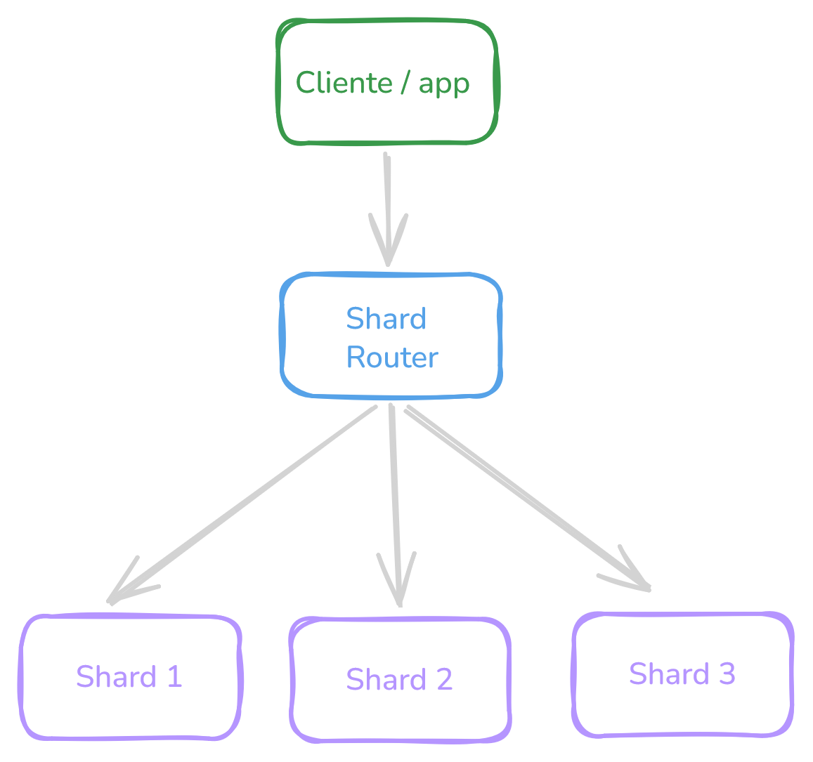

# Database Sharding

El **sharding** (también llamado *horizontal partitioning*) es una técnica para escalar bases de datos dividiéndola en fragmentos independientes llamados **shards (fragmentos)**, cada uno con su propio almacenamiento y capacidad de cómputo. La idea es simple: en vez de tener una sola base de datos que lo aguanta todo, los datos se distribuyen entre muchos nodos.

Sirve para resolver los problemas clásicos de escala:

- **Capacidad de almacenamiento:** cuando los datos ya no caben en un solo servidor.
- **Rendimiento de lectura/escritura:** al distribuir la carga, más operaciones se pueden procesar en paralelo.
- **Alta disponibilidad:** los fallos se aíslan a un shard, no tumban todo el sistema.



La query llega al **Shard Router**, que conoce el mapa de distribución y la reenvía al shard correcto. Cada shard también puede tener sus propias réplicas para tolerancia a fallos.

## Estrategias de sharding

La decisión más importante es cómo elegir la **shard key** (clave según la que se hace la fragmentación) y qué estrategia de distribución usar.

### Por rango
Divide los datos por rangos de valores.

**Ejemplo:**

Shard 1 → IDs 1–1000
Shard 2 → IDs 1001–2000

**Ventajas:** 
- Simple de implementar
- Queries de rango muy eficientes (`ORDER BY`, `BETWEEN`)

**Desventajas:**
- puede generar hotspots (un shard muy cargado)

### Por hash
Aplica una función hash sobre la shard key.

**Ejemplo:**

```sql
hash(user_id) % N
```
**Ventajas:** 
- Distribución muy uniforme
- Sin hotspots
- Predecible para queries puntuales

**Desventajas:**
- Difícil hacer consultas por rango

### Por geografia
Divide los datos según ubicación.

**Ejemplo:**

- Usuarios de América | shard 1
- Europa | shard 2

**Ventajas:** 
- Baja latencia para usuarios locales
- Cumplimiento de regulaciones de datos por región

**Desventajas:**
- Distribución desigual si una región crece más
- Complejo si los datos se cruzan entre regiones

## Desafíos del sharding

El sharding no es gratis. Introduce complejidad que hay que entender bien:

**Cross-shard queries:** un `JOIN` entre datos en distintos shards requiere federar resultados en la capa de aplicación o en el router. Es lento y costoso. El diseño de la shard key debe minimizar estas situaciones agrupando datos que se consultan juntos en el mismo shard.

**Rebalanceo:** al agregar shards, los datos existentes deben moverse. Con hash sharding esto es particularmente doloroso porque el módulo cambia. El **consistent hashing** es la solución estándar: los nodos se ubican en un anillo, y agregar un nodo solo mueve una fracción de las claves vecinas en lugar de redistribuir todo.

**Transacciones distribuidas:** ACID entre shards es muy difícil. La mayoría de sistemas aplican transacciones solo dentro del mismo shard, y aceptan consistencia eventual o protocolos como Two-Phase Commit (2PC) para lo cross-shard.

**Hotspots:** si la shard key es predecible (como timestamp), los writes siempre golpean el mismo shard. Solución: agregar entropía con un prefijo hash o usar una shard key compuesta.


## ¿Cuándo usarlo?

El sharding se justifica cuando el volumen de datos o la tasa de escrituras genuinamente supera lo que un solo nodo puede manejar, algo que ocurre típicamente en el orden de los cientos de millones de registros o decenas de miles de escrituras por segundo. Sistemas como MongoDB, Cassandra, Vitess (MySQL) y CockroachDB incluyen sharding automático incorporado.