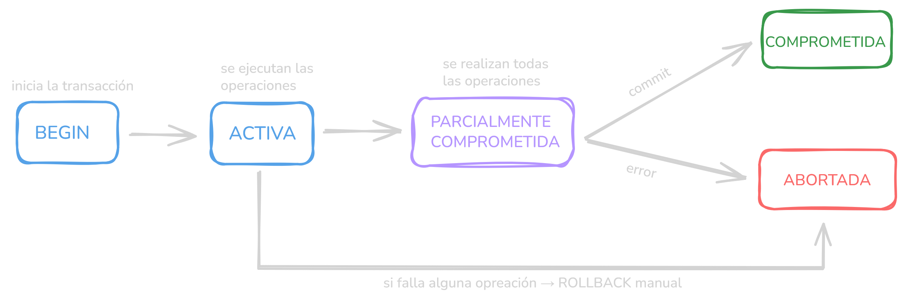

# Transacciones

Una **transacción** es una unidad lógica de trabajo que agrupa una o más operaciones de base de datos. La idea central es simple: o todas las operaciones se ejecutan con éxito, o ninguna tiene efecto. Esto garantiza que los datos siempre queden en un estado consistente.

El ejemplo clásico es una transferencia bancaria: para mover $100 de la cuenta A a la cuenta B, se necesitan dos operaciones (debitar $100 a A y luego acreditar $100 a B). Si el sistema fallara entre ambas y se debita de A pero no se acredita a B o visceversa, sin transacciones, se perderia dinero de la nada.

## Las propiedades ACID

Todo sistema de transacciones serio garantiza cuatro propiedades conocidas como ACID:

- **Atomicidad (Atomicity):** Si una operación falla entonces se deshace todos los cambios y se retorna al estado original.

- **Consistencia (Consistency):** La base de datos siempre pasa de un estado válido a otro válido. Se respetan reglas, constraints, claves, etc.

- **Aislamiento (Isolation):** Las transacciones no se interfieren entre sí. Cada una ve los datos de forma controlada.

- **Durabilidad (Durability):** Una vez confirmado (COMMIT), los cambios son permanentes, incluso si el sistema se cae.


## Implementación en SQL

La sintaxis básica es prácticamente estándar en todos los motores:

```sql
BEGIN;  -- o START TRANSACTION

UPDATE cuentas SET saldo = saldo - 100 WHERE id = 'A';
UPDATE cuentas SET saldo = saldo + 100 WHERE id = 'B';

COMMIT;  -- confirma todos los cambios
-- o ROLLBACK si queremos revertir
```

Tambien se pueden manejar errores:

```sql
BEGIN;

UPDATE cuentas SET saldo = saldo - 100 WHERE id = 'A';

-- Si hay error, revertimos
SAVEPOINT antes_de_credito;
UPDATE cuentas SET saldo = saldo + 100 WHERE id = 'B';

-- Si falla solo esta parte:
-- ROLLBACK TO SAVEPOINT antes_de_credito;

COMMIT;
```

Los **savepoints** permiten revertir solo una parte de la transacción sin perder todo el trabajo previo.

## El ciclo de vida de una transacción

Una transacción pasa por estados bien definidos desde que comienza hasta que termina:

### Inicio - Begin
Se reservan recursos internos y se inicia la transacción.

```sql
BEGIN;
-- o equivalentemente:
START TRANSACTION;
```

### Activa - Active
La transacción está ejecutando operaciones. Puede realizar cualquier cantidad de lecturas y escrituras. Los cambios que hace son visibles para ella misma, pero aún no para otras transacciones (dependiendo del nivel de aislamiento).

```sql
-- Estando activa, se ejecutan operaciones:
SELECT saldo FROM cuentas WHERE id = 'A';
UPDATE cuentas SET saldo = saldo - 100 WHERE id = 'A';
UPDATE cuentas SET saldo = saldo + 100 WHERE id = 'B';
```
Luego de esto, hay dos estados posibles:

- **Parcialmente comprometida:** Si se ejecutó la última operación sin errores
- **Fallida**: Si ocurrio algún error con alguna operación (violación de constraint, deadlock, timeout, crash, etc.) 

### Parcialmente Comprometida - Partially committed
La última operación de la transacción se ejecutó exitosamente. El motor está en el proceso de verificar si puede confirmar los cambios de forma permanente. 

### Comprometida - Committed
Se ejecuta `COMMIT` y los cambios pasan a ser permanentes.
```sql
COMMIT;
-- o equivalentemente:
END;
```
### Abortada - Aborted
El motor detectó que la transacción no puede continuar ni ser comprometida. En este estado la transacción ya no puede ejecutar operaciones. El motor la marca como fallida y la aborta. En muchos motores, detectar el error dispara el rollback automáticamente.
```sql
-- Ejemplo: constraint violation
UPDATE cuentas SET saldo = -500 WHERE id = 'A';
-- ERROR: new row violates check constraint
-- La transacción es fallida y se aborta.
```

**Esquema de ciclo de vida:**


## Cómo lo implementan los motores internamente

Los motores de base de datos usan dos mecanismos principales para implementar transacciones:

**Write-Ahead Log (WAL):** antes de modificar datos en disco, el motor escribe la operación en un log. Si el sistema cae, puede reconstruir el estado desde ese log. Esto garantiza durabilidad.

**MVCC (Multi-Version Concurrency Control):** en lugar de bloquear datos, el motor guarda múltiples versiones de cada fila. Cada transacción ve una "foto" (snapshot) consistente de los datos en el momento en que empezó. PostgreSQL y MySQL InnoDB usan este enfoque, lo que permite alta concurrencia con muy pocos bloqueos.

En código de aplicación, las transacciones se manejan así (ejemplo con Python/SQLAlchemy):

```python
from sqlalchemy.orm import Session

with Session(engine) as session:
    with session.begin():  # abre transacción automáticamente
        cuenta_a = session.get(Cuenta, 'A')
        cuenta_b = session.get(Cuenta, 'B')
        
        cuenta_a.saldo -= 100
        cuenta_b.saldo += 100
        
        # COMMIT automático al salir del bloque
        # ROLLBACK automático si hay excepción
```

El patrón `with session.begin()` es el más recomendado hoy en día porque garantiza rollback automático ante cualquier error, sin necesidad de `try/except` manual.